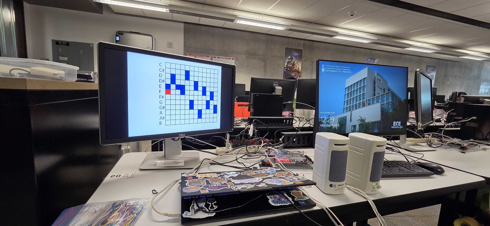
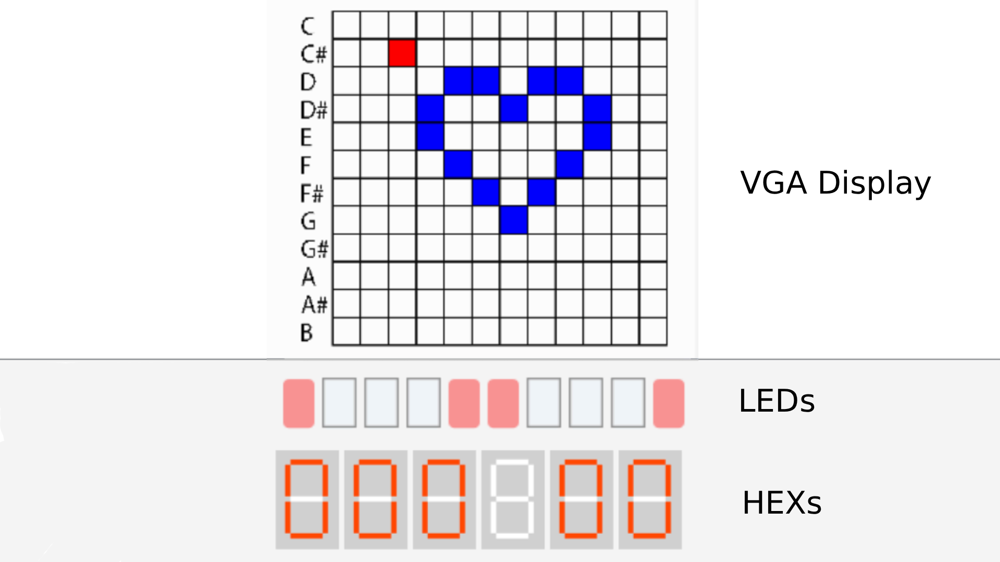

For the final project in ECE241 (Digital Systems), I implemented a Step Sequencer on the DE1-SoC. This class was my introduction to Verilog and FPGA development, and I wanted to diverge from the games most others made. 

My first idea for this project was to create a waveform generator where you could actually "draw" a wave on the VGA display and have the FPGA output that exact analog signal. However, after talking it over with one of my TAs, I realized that the DE1-SoC doesn't have a built-in DAC. Without a Digital-to-Analog Converter, generating a raw analog voltage for a custom wave wasn't going to be easily feasible.

My TA suggested that instead of a pure analog output, I could pivot to audio and output a signal to a speaker, which was much more feasible for the board's hardware. After thinking about it some more, I decided to move toward a Step Sequencer. 

In this version, I built a grid on the VGA display representing the middle C octave of a piano. Users can interact with the grid using a PS2 keyboard to select specific notes, which the FPGA then sequences and plays back in real-time. The current position in the grid is shown by the red square cursor, and selected squares turn blue.

For further control, I added the ability to choose the number of times to loop through the sequence and to select the BPM to step through the loops. This information is displayed on the HEXs.

For specific information on functionality, check out the project repository below.

