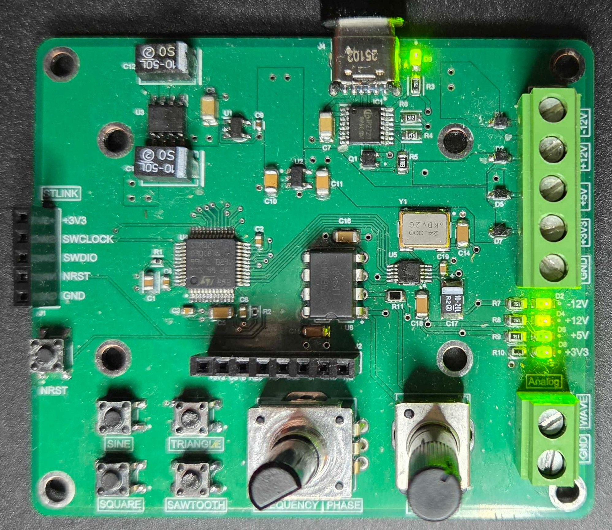
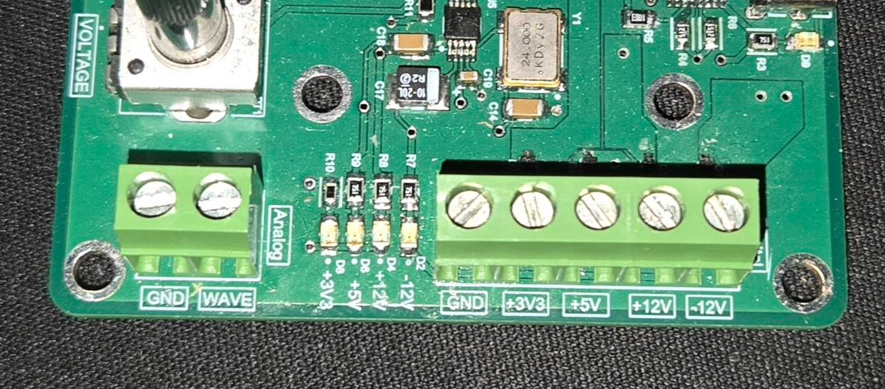
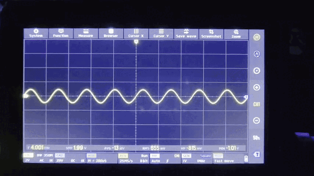
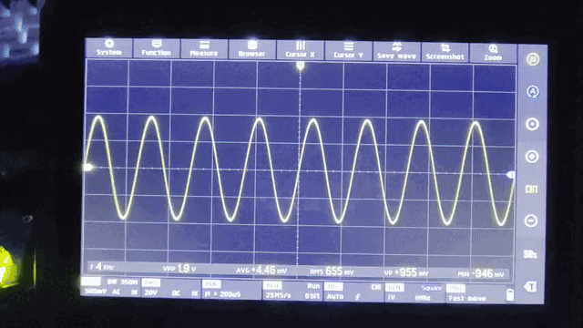
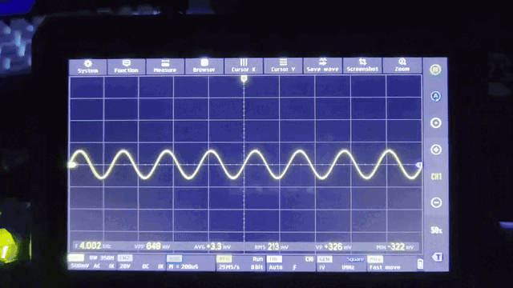
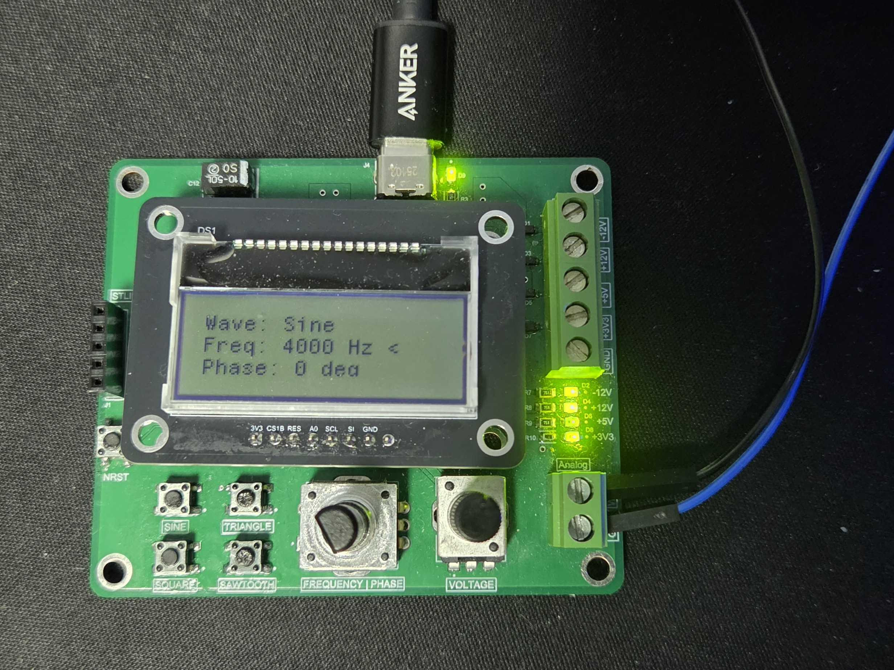
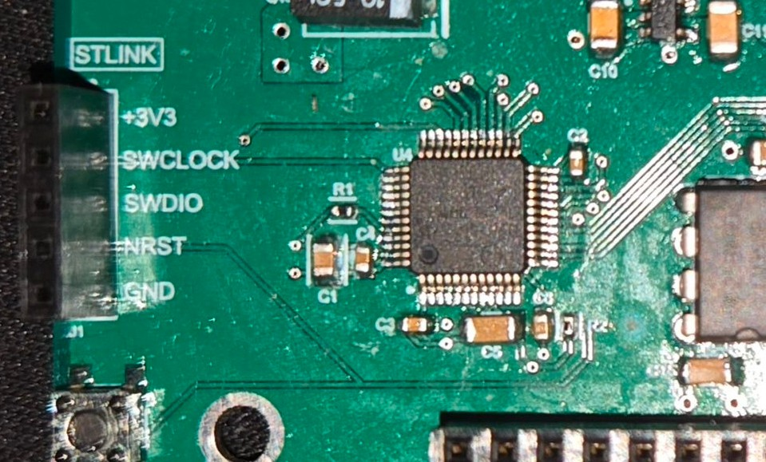

Earlier this year, as I started diving deeper into breadboarding and analog circuits, I realized I didn't have access to a bench power supply outside of the university lab.

To make Op-Amp circuit without the headache of DC biasing all the time, a simple 5V USB brick isn't enough. I needed positive and negative rails to handle analog signals, and that is exactly why I built this board. My goal was to move away from lab equipment and design a portable power distribution board using USB-C Power Delivery. I was also hoping it would be cheaper than buying a bench supply, but it was a learning opportunity either way.

To handle the power negotiation, I used the IP2721 IC to communicate with 45W USB-C sources. This allowed the board to request the required power from a standard charger block. From there, I used linear regulators and a charge pump to provide various DC voltage rails, and the AD9833 waveform generator IC for a custom signal output.

 

This was my first 4-layer PCB design, and stepping up from 2 layers was a nice change. I've since used it to power many circuits up to 100mA without any issue. 

After putting it off for a few months, I finally got around to finishing the firmware for this board. Here is a look at what it can do:

### Power Supply

The board provides easy access to the power rails through standard screw terminals, with +12V, -12V, +5V, and +3V3 available for breadboarding.

### Signal Output

For the waveform generation, I set up the buttons to easily toggle between sine, square, and triangle waveforms. I actually realized a bit too late that the AD9833 doesn't natively support sawtooth waves (oops), so that button just toggles a half-frequency square wave instead.

 

I used a rotary encoder to control the output frequency and phase. Clicking the encoder toggles between the two modes.

 

The output voltage amplitude is controlled by a potentiometer that sets the gain of an op-amp stage. Looking back, I wish I had AC coupled the op-amp input, but it works well enough.

### System Interface

The header in the middle allows for an optional LCD display to be connected, which displays the real-time waveform, frequency, and phase parameters so I know exactly what's being output.

 

All firmware runs on an STM32F030C8T6 microcontroller and programming this board was really easy thanks to the onboard ST-LINK. I used interrupts for the rotary encoder and buttons so I wouldn't miss inputs by polling.

 

As always, the files for this project are available on my [GitHub](https://github.com/wavius/Waveform-Generator).

