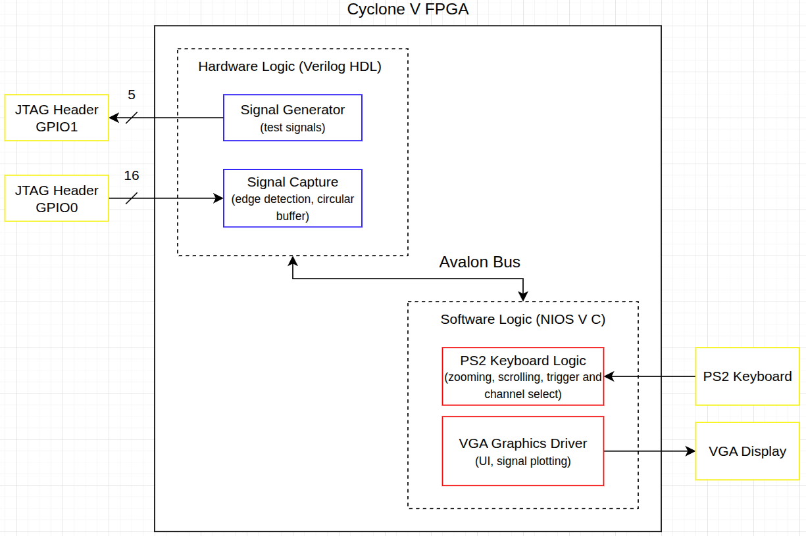

[Images coming soon!]
 
For our final project in ECE243 (Computer Organization), my partner and I turned our DE1-SoC FPGA into a 16-channel Logic Analyzer.

If you’ve ever worked with digital electronics, you know that a multimeter isn't enough. To actually see what’s happening, you need a way to sample and display signals in real-time, and that is exactly what this project was about. My main goal going in was to learn how to interface a custom hardware module with the Nios V (RISC-V) soft processor we had been using throughout the course.

Our implementation is shown in the block diagram:

To handle the high-speed sampling, I wrote a custom Verilog module to monitor 16 different JTAG header pins. Since software is far too slow to catch every tiny pulse, we implemented a circular buffer in the FPGA fabric that constantly recorded data while waiting for a rising edge trigger. This allowed us to capture the signal state both immediately before and after an important event, ensuring we didn't just plot empty data.

To manage the VGA display and user interface, we interfaced a soft Nios V processor with our hardware by instantiating the Verilog module as Memory-Mapped I/O. Using Quartus and Platform Designer, we connected the module as an Avalon-MM Slave, allowing our C code to talk directly to the hardware registers by reading and writing to an address in memory.

Our UI was controlled by a PS2 keyboard and featured scrolling, multiple zoom levels, trigger channel select, and channel enable.

This project was a massive lesson in Hardware-Software integration, and I'm excited to use this experience to design a fully functional oscilloscope in the near future. 

For specific information on this project, visit the repository below.

