## Overview

ECE295 (Hardware Design and Communication) had teams work to implement different subsystems of the Flexible Radio Transceiver (**FLRTRX**). My team was assigned subsystem A, the receiver (RX) filter and quadrature mixer.

## Design

Our design consisted of 5 main stages shown in the block diagram below:

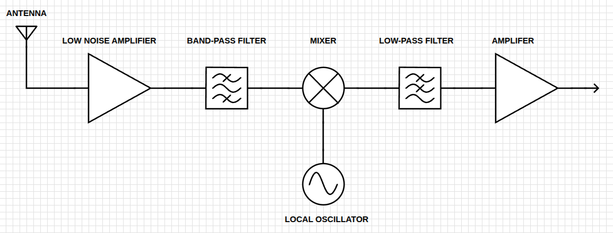

My team decided to go with a fully discrete design as we thought it was the more interesting approach. The main advantage of this was the transistor design experience and practice using LTSpice to verify my circuits.

### Band-pass Filter

**Requirements**:
- 8 and 16 MHz cutoff frequencies
- Amplitude balance within 1dB over the passband

We opted for a 3rd-order passive Butterworth filter for this stage. While we originally considered an active topology to mitigate insertion loss, the MHz-range bandwidth made it unfeasible for most op amps. The Butterworth response seemed like the most logical choice here; its maximally flat passband was would maintain the amplitude balance required across the 8-16 MHz window.

  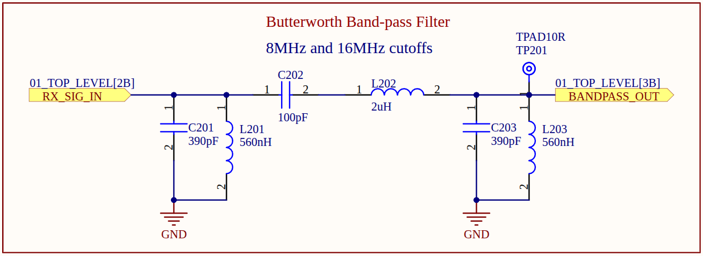

### Low Noise Amplifier (LNA)

**Requirements**:
- 50 ohm input impedance
- Noise <3nV/√(Hz)

While the course requirements for our subsystem didn't include an LNA, we wanted a stage to compensate for any losses in our band-pass filter, mask out the noise contribution from subsequent active stages (like our mixer), and also present a 50 ohm input impedance to the band-pass filter. This way, we would get the correct frequency response and preserve the weak receiver signal.

I designed a cascode (common-emitter to common-base) amplifier for this purpose.

  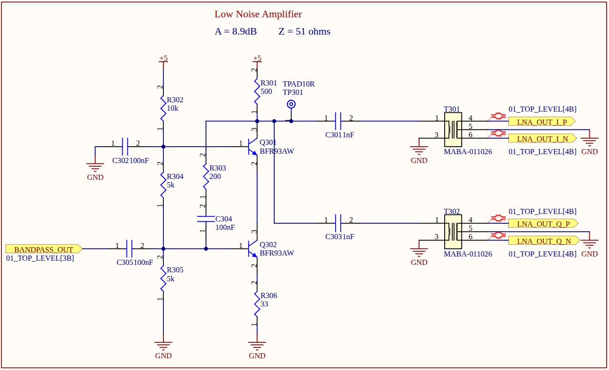

### Gilbert Cell Mixer

**Requirements**: 
- 90 degree (12.5 degree tolerance) phase difference between I/Q signals

Here we chose an active mixer to again avoid passive losses. The Gilbert Cell also offered superior local-oscillator-to-intermediate-frequency isolation, resulting in a cleaner output. We were unconcerned with the added noise because of the previous LNA stage.

  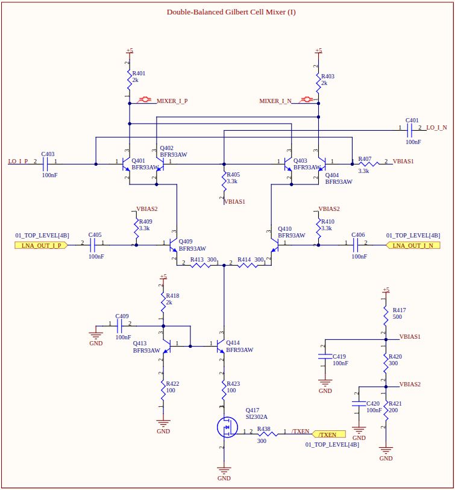

### Low-pass Filter

**Requirements**: 
- 92 kHz cutoff frequency

We chose a second order Sallen-Key active filter. This topology yielded the same Butterworth response as the band-pass filter without any of the losses.

  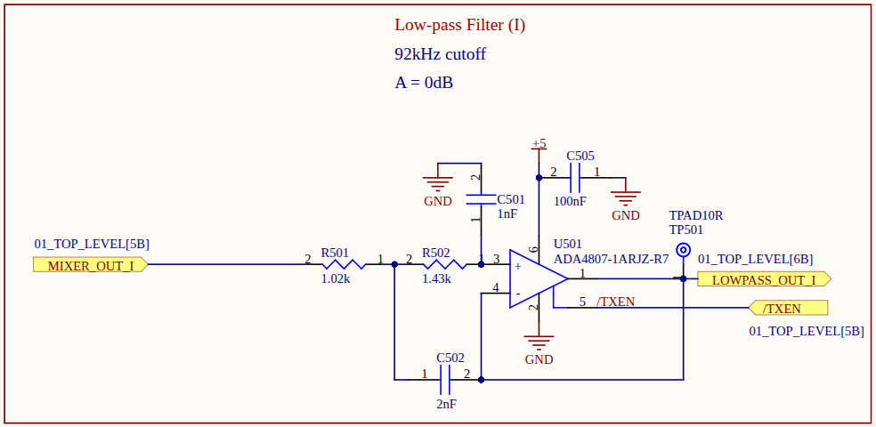

### Amplifier

**Requirements**: 
- ≥30 dB post mixer gain

Observant readers may be wondering why we didn't just include the required gain in the low-pass filter or differential amplifier post mixer. The answer to that wonderful question is: we wanted easy control over the final gain by only swapping one resistor. This is accomplished by a non-inverting amplifier, which also keeps our other stages isolated and unaffected.

  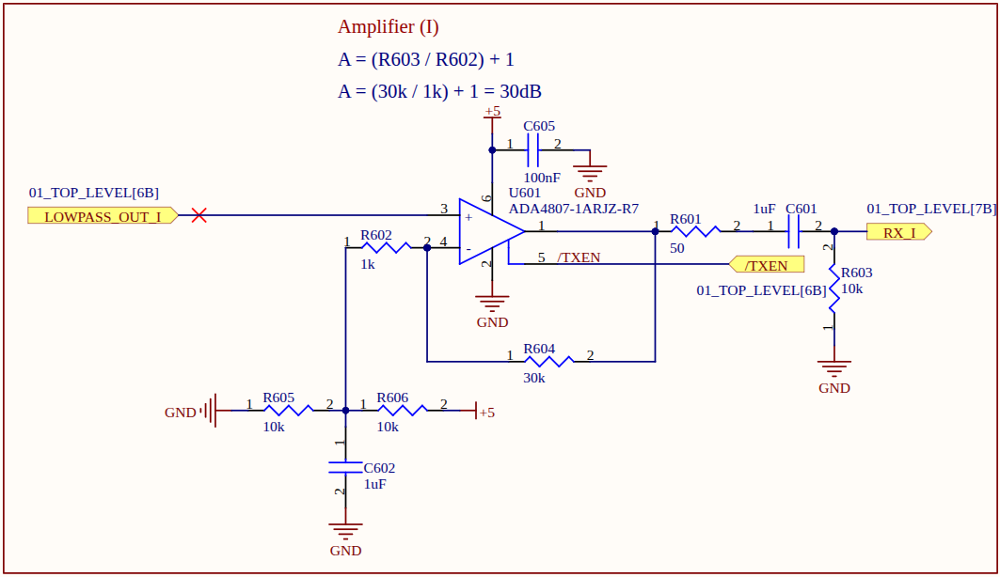

## PCB Assembly

Near the end of the semester. We got to actually assemble and test our design. Our components were all SMDs apart from the connectors, but I had all the equipment (heat gun, soldering iron) for my team to assemble it without much trouble.

I really love how the silkscreen turned out (and the design of course 😉).

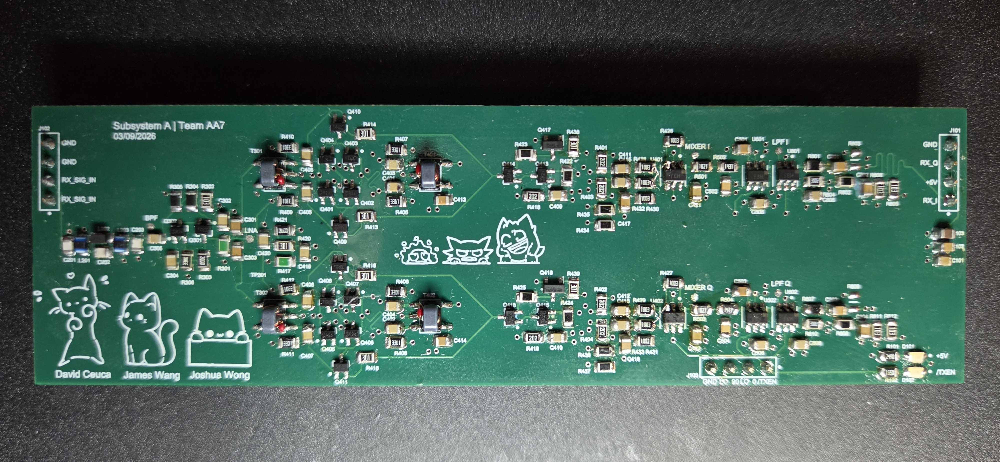

### Issues

After assembly, we found out that the differential amplifier pins (inverting/non-inverting) were flipped during the PCB layout phase. Since this obviously broke our entire design, I had to think of a fix that didn't involve re-ordering the PCB.

In the end, I lifted the affected op-amp pins to prevent contact with the existing pads and used fine strands from a 22AWG wire to manually jump the pins to the correct resistor nodes. This fix worked and, luckily, meant a potential crisis was averted.

The image on the left shows the elevated front pins; the image on the right shows the wiring.
 

  
  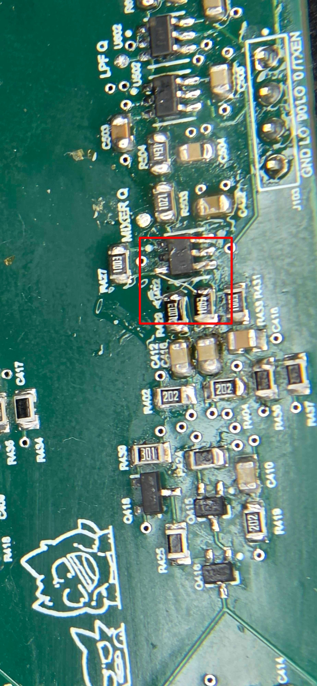

 

## Testing

We went to the lab to test our board and were very pleased with the results! We were successfully isolating the baseband frequency of the input signal because as it turns out, Spice doesn't lie 🤭.

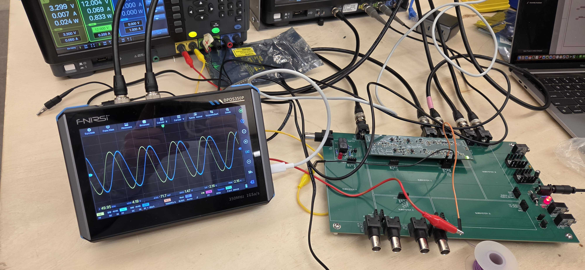

For in depth testing, the course provided us with Python scripts that would control the lab equipment and produce Bode plots to evaluate our different stages. I included everything below, and you can compare our results to the subsystem requirements in the design section to judge how we did for yourself.

#### Band-pass Filter
Band-pass filter frequency response.

  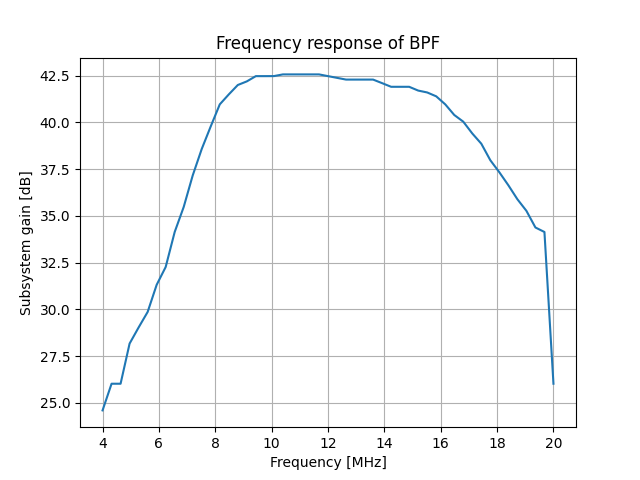

 

#### Amplitude Balance
Measures the difference in amplitude between I/Q signals.

  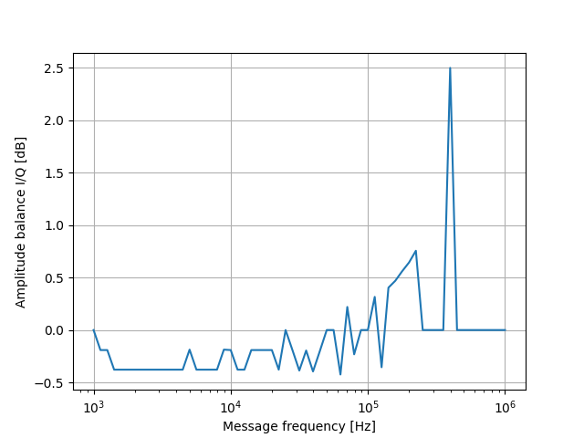

 

#### Low-pass Filter
Low-pass filter frequency response.

  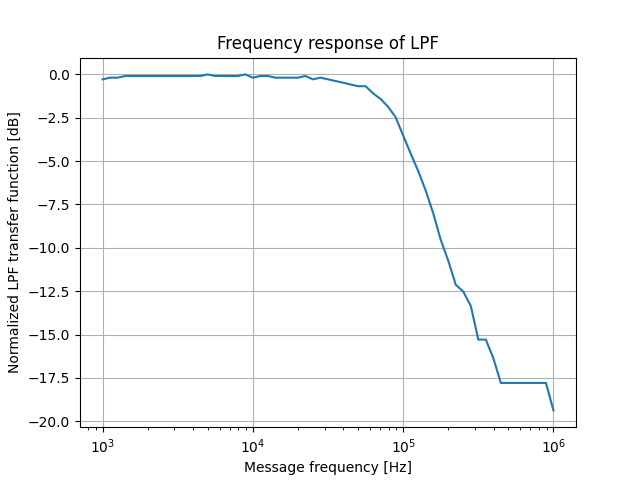

 

#### Phase
Measures the difference in phase between I/Q signals.

  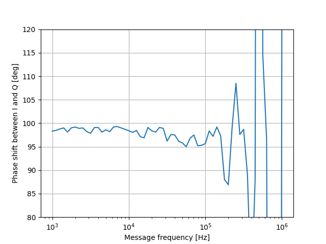

 

#### Subsystem gain
Measures the total signal gain throughout the subsystem.

  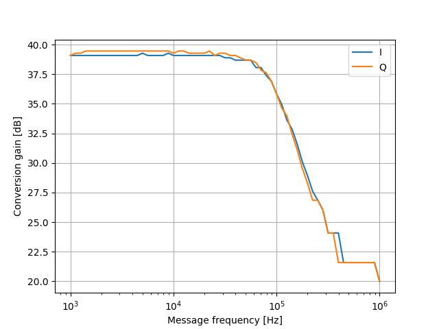

## Final Thoughts

I am really proud of our design and I think we did super well! This course has been one of my favorites, and I enjoyed it quite a lot. Special thanks to my teammates James and Joshua for their hard work.

The Spice and Altium files are on my [GitHub](https://github.com/wavius/Subsystem-A-ECE295).