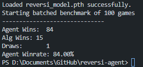

## Overview

In my first year of engineering I took APS105, an introductory course on the C programming language. One of the labs in this course involved creating an algorithm to play Reversi. To make it more engaging for students, the profs created a leaderboard to rank the best algorithms. Despite quite a bit of work, I think I placed around 15th or so, while one of my friends placed in the top 3.

If you're not familiar with Reversi, it is a two-player game played on an 8x8 grid where players take turns placing black or white disks on the board. At the end of the game, the player with the most pieces of their color facing wins. The catch is that you can flip your opponent's pieces by trapping them with 2 of your pieces placed on either side.

Now, instead of making an algorithm like I'd already done, my goal here was to train an agent with machine learning to beat my friend's Minimax algorithm. The only type of machine learning I knew anything about was reinforcement learning, where an agent learns to make decisions by getting rewarded or penalized for taking actions in an environment. Luckily, this strategy seemed perfect for Reversi. 

You can play against my Agent and the other algorithms below or on its [GitHub Pages](https://wavius.github.io/reversi-agent/web/) site. You can also continue reading to learn more about this project.

  <iframe 
    src="https://wavius.github.io/reversi-agent/web/" 
    title="reversi-agent" 
    style="border:none; width:100%; height:500px;">
  </iframe>

## Architecture

To create the agent, I chose to use PyTorch, mainly because of its neural network tools and GPU acceleration which allowed for much faster model training. At a high level, the agent works by taking in a board state and outputting an evaluation consisting of a policy (probability for each valid move, where a higher probability means the agent is more confident in that move) and a value (who is currently winning). The agent then uses that information to select a move. To make it stronger, I also added a Monte Carlo Tree Search (MCTS), meaning the agent makes many different moves and searches the game tree to find the sequence of moves that maximizes the value, instead of choosing the immediate best move.

For training, I let the agent play against itself. At first, the moves it chooses are mostly random, but it eventually develops a strategy after many game iterations.
The current model is trained on ~120k games, which took about 8 hours total, and the training time increased significantly with MCTS. My reward strategy was also pretty basic, where the agent would get a +1 reward if it won, or a -1 penalty if it lost. Of course, a more sophisticated reward system could be implemented, but I didn't think it was necessary for what I was trying to do.

## Results

In the end, the agent was beating Minimax pretty consistently. It might not have been entirely fair, since I'm pretty sure the agent got more time to play a move, but I was happy with the results.

  

 

The source code can be found on [GitHub](https://github.com/wavius/reversi-agent).

