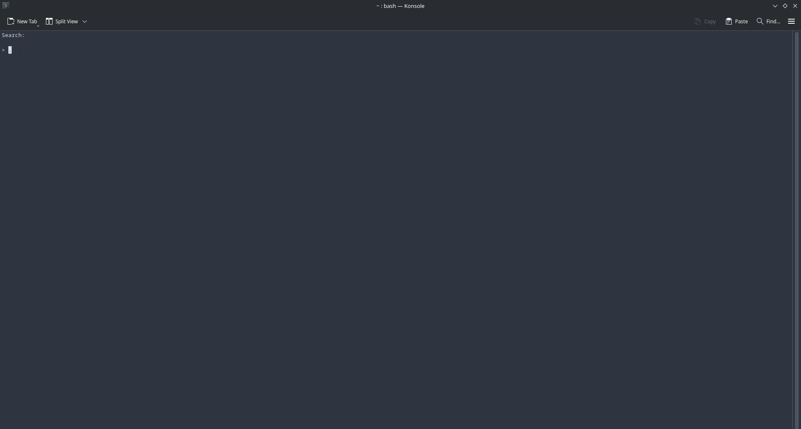
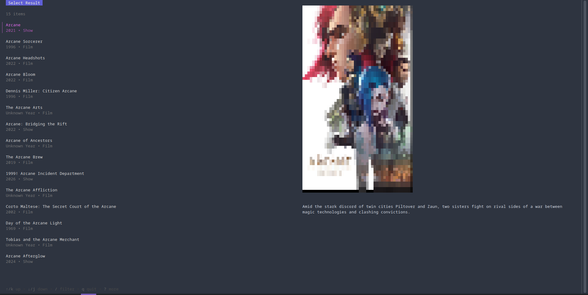
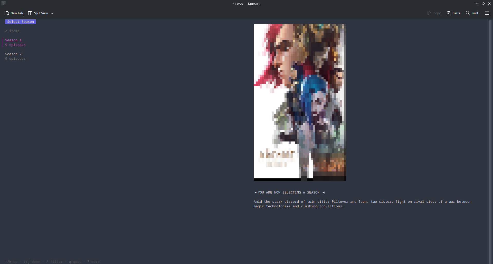
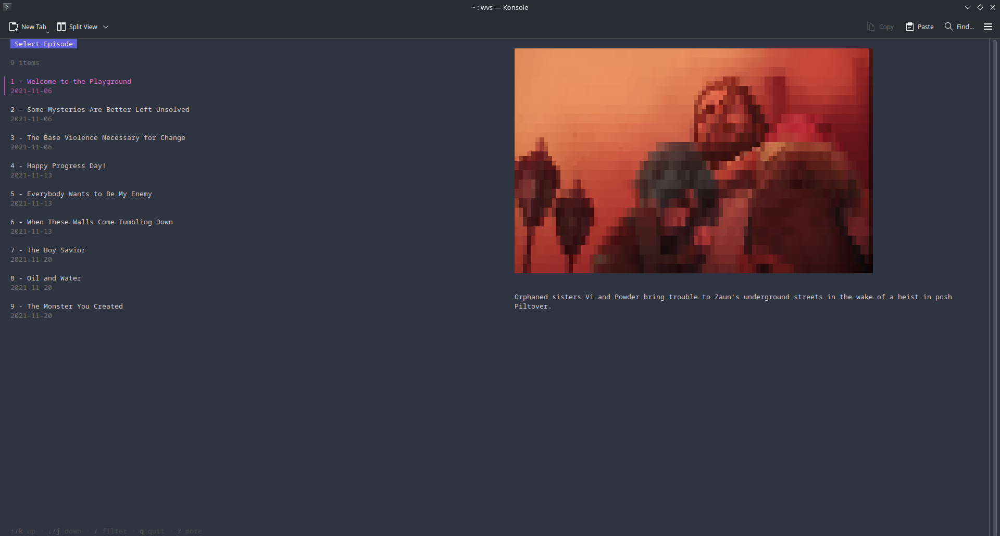
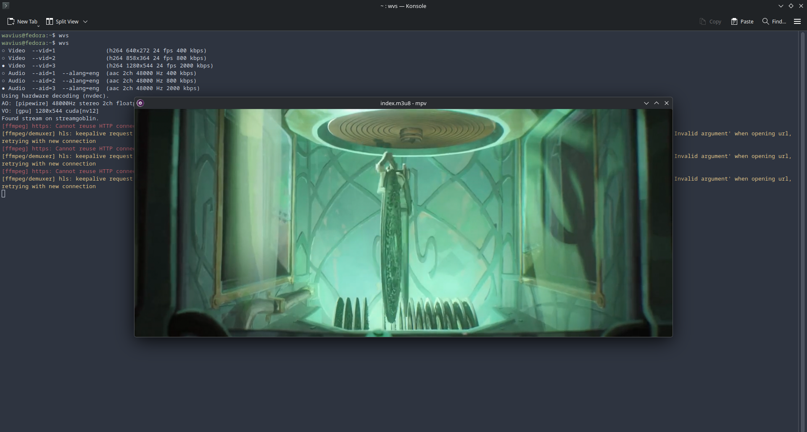

## Overview

I really enjoy watching shows in my free time. What I don't like, however, is having to find a place to watch them. Some sites might not have the show I'm looking for, the stream source might be down, or it might just be too sketchy. At some point, I got fed up with this and started searching for a solution. I came across [ani-cli](https://github.com/pystardust/ani-cli), a command-line interface (CLI) tool to browse and play anime, which was exactly what I had in mind. 

I decided to make my own version of this tool, extending it to a variety of media, so I could watch everything in one place. I would also be able to customize the UI to my liking. With that, I created [wvs-tui](https://github.com/wavius/wvs-tui), a terminal-user interface (TUI) tool to watch anime/shows/movies.

## Functionality

Using the tool is pretty straightforward. Running `wvs` on its own drops you into an interactive search mode, or you can skip to the search results by passing a query like `wvs arcane`.

  

  

 

You can move through lists with `j`/`k` or the arrow keys, hit `/` to filter results as you type, and press `Enter` to confirm a selection and move forward. `Backspace` takes you back a screen, and `q`, `Esc`, or `Ctrl+C` quits.

  

  

 

After picking a show or movie and an episode, the tool scrapes a source and plays the video in mpv.

  

 

For the full list of flags (quality, source selection, debug mode, and more), check out the [repository](https://github.com/wavius/wvs-tui).

## Architecture

At its core, wvs-tui is a web scraper that fetches metadata from [The Movie Database (TMDB)](https://www.themoviedb.org/) API, scrapes streaming sites for video links using headless Chrome, and finally plays them using [mpv](https://mpv.io/). 

While opening an instance of Chrome takes more resources, it ensures the tool can properly scrape sites that use JavaScript to load their video players. Hence, it works with modern sites and makes finding sources much more reliable.

The actual program is written in Go. The [Bubble Tea](https://github.com/charmbracelet/bubbletea) framework was used for the TUI and [Chromedp](https://github.com/chromedp/chromedp) was used for scraping. If you don't already know, Go programs can be cross-compiled and, more importantly, they compile into a single self-contained binary. This reduces the program's dependencies and makes it easier to install.

## Download

If you want to try it out for yourself, you can find the download instructions for Windows and Linux in the repo below.

