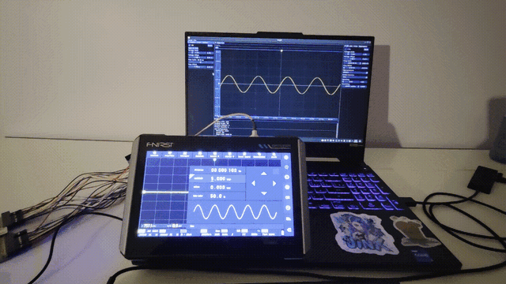
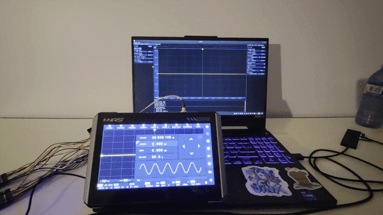
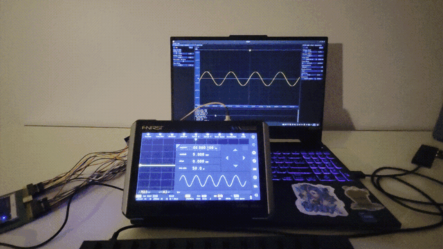
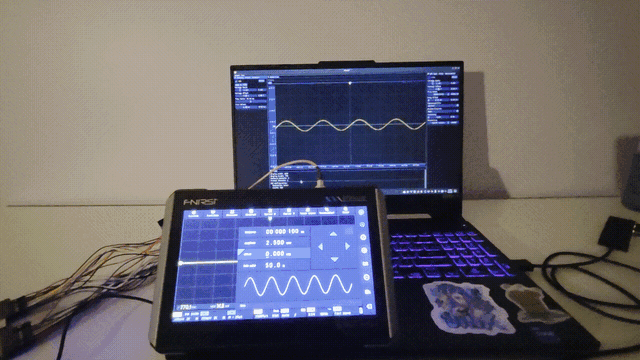
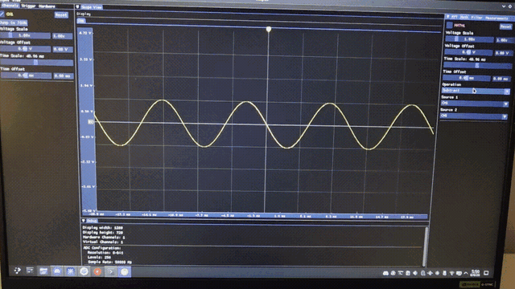
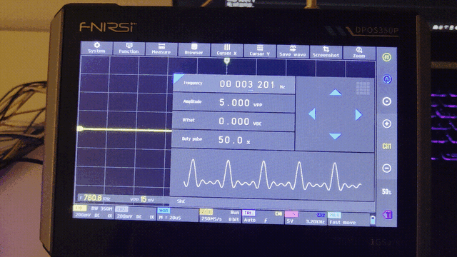
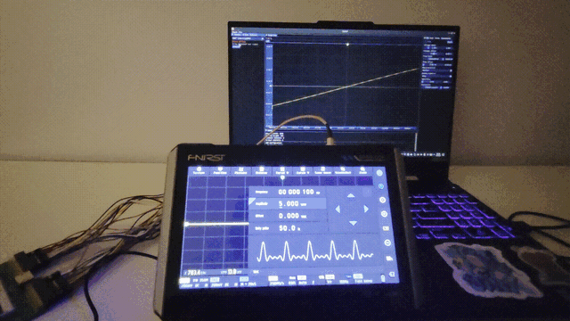
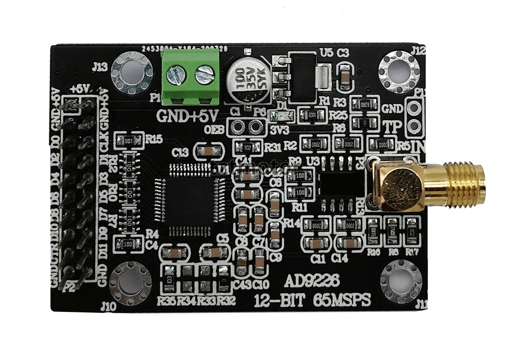
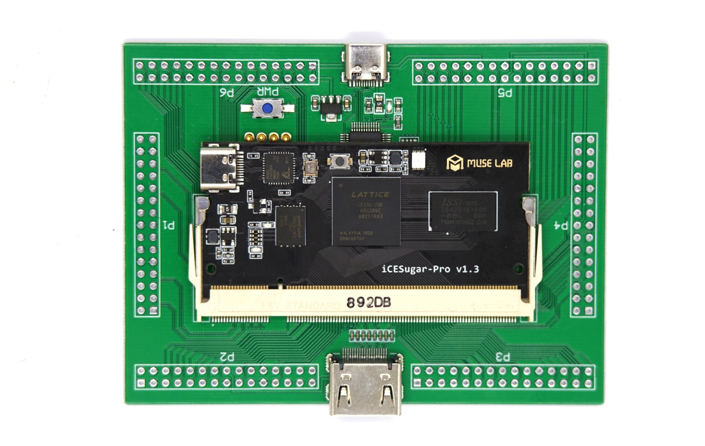
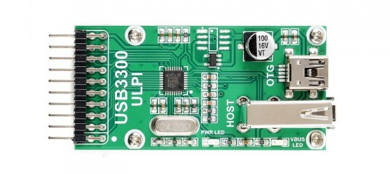

## Overview

TBA.

The rest of this post provides a demo and brief explanation of Scoped. As always, the Scoped repository in the [Building](#building) section describes everything in more detail if you are interested.

## Demo

Scoped is designed with a modern, modular user interface featuring fully dockable tabs.

  

  

Scoped accurately displays various signals from my signal generator, with specific properties tested below. 
Note that UART was used for testing (see [Hardware](#hardware)).

### Waveform types 

  

 

### Amplitudes

  

 

### Frequencies 

  

 

### DC Offsets

  

 

## Features

Scoped includes a lot of common oscilloscope tools.

### Trigger

Supports rising and falling edge triggering with selectable source and level, in either auto (50 ms) or normal (wait-for-edge) mode.

  

 

### FFT

Real-time FFT, with several window functions (Rectangular, Hanning, Hamming, Blackman-Harris, Flat Top) and a linear or decibel scale.

  

 

### Filters

Lowpass, highpass, bandpass, and bandstop responses in Butterworth, Bessel, or Chebyshev topologies, with a live frequency response graph.

  

 

### Math

Per-channel math operations: addition, subtraction, multiplication, inversion, integration, and differentiation.

  

 

### Measurements

Automatic readouts for Vpp, Vrms, Vavg, Vmin, Vmax, frequency, and period.

  

 

## Architecture

Scoped runs a modular data pipeline. Data flows from the FPGA backend, through the oscilloscope hub and channels, into a set of expandable processors (FFT, filters, math, measurements), and finally to the UI that renders everything. 

## Hardware

The hardware backend is made up of an FPGA board, an ADC module, and a USB PHY, all wired together with jumper cables. You can connect over either UART or USB 2.0:

- **UART:** 1 MBaud, good for up to ~50 kHz acquisition; slower but stable.
- **USB 2.0:** Up to 480 Mbps, supporting a 25 MHz acquisition rate; much faster, but the high-speed signals are prone to integrity issues over the jumper wires.

  

 

### ADC

> AD9226 (65 MSPS, 12-bit)

  

 

### FPGA

> Lattice ECP5 on the Muse LAB iCESugar-Pro v1.3

  

 

### USB PHY

> USB3300 USB High-Speed PHY Board

  

 

## [Building](https://github.com/wavius/Scoped#building-from-source)

The software frontend is built with CMake (>= 3.15) and a C++20 compiler, using SDL2, OpenGL, and libusb. The FPGA bitstream is built with Yosys, nextpnr-ecp5, and Project Trellis, and the RTL can be verified with Verilator simulations. Full instructions are in the repository.

