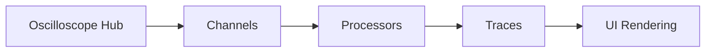
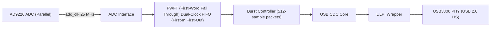

## Overview

After working on a logic analyzer (the digital version of an oscilloscope) in a previous project, I figured that extending it to a full oscilloscope shouldn't be all that hard. All I really had to do was hook up an ADC to the setup instead of sampling directly on an FPGA's GPIOs. I also liked FPGA development a lot, so I wanted to stick with the same approach here.

I had seen software oscilloscopes before, and with my constrained budget, I figured it'd be a lot better to run the UI on my laptop and have the backend stream samples over USB, rather than use a dedicated screen (which would be way more annoying to debug and set up). I knew the main drawback of this approach would be sampling rate, since USB 2.0 High-Speed (HS) maxes out at 480 Mbps, which puts the max sample rate in the tens of MHz. For my purposes, though, that was plenty, and I was most interested in working on the HDL.

The UI was built in C++, mainly for the performance it offered and because I wanted more experience with it. I used ImGui for the UI and rendered the samples as an intensity map: the map is rasterized on the CPU and drawn on the GPU. The backend basically just captures samples, and everything else is done in software, including the scope's buffer, triggering, plotting, and signal processing. That's fine though, since laptop CPUs tend to be quite fast. In the future, I could probably get a faster sampling rate by handling the triggering on the FPGA and streaming full buffers instead of live samples.

For the hardware backend, I used an ADC test board, a USB HS PHY, and an iCESugar-Pro FPGA board, all connected using jumper wires. I decided to work with two separate clocks: one from the USB PHY and one from the internal FPGA clock. This was my first time dealing with clock-domain crossing, and it was interesting to learn how to design async FIFOs and why gray code is used to reduce the impact of metastability.

I was planning to make a dedicated PCB for this project, but I haven't gotten to it yet. During testing, I had problems with signal integrity and ground loops and had to resort to UART instead of USB (which had a much slower sampling rate). I think these issues would be fixed by a custom board.

Regardless, I had a lot of fun with this project. I definitely enjoyed the hardware side more, but the software was nice to figure out and useful to know.

The rest of this post provides a demo and brief explanation of Scoped. As always, the Scoped repository in the [Building](#building) section describes everything in more detail if you're interested.

## Demo

Scoped is designed with a modern, modular user interface featuring fully dockable tabs.

  

  

Scoped accurately displays various signals from my signal generator, with specific properties tested below. 
Note that UART was used for testing (see [Hardware](#hardware)).

### Waveform types 

  

 

### Amplitudes

  

 

### Frequencies 

  

 

### DC Offsets

  

 

## Features

Scoped includes a lot of common oscilloscope tools.

### Trigger

Supports rising and falling edge triggering with selectable source and level, in either auto (50 ms) or normal (wait-for-edge) mode.

  

 

### FFT

Real-time FFT, with several window functions (Rectangular, Hanning, Hamming, Blackman-Harris, Flat Top) and a linear or decibel scale.

  

 

### Filters

Lowpass, highpass, bandpass, and bandstop responses in Butterworth, Bessel, or Chebyshev topologies, with a live frequency response graph.

  

 

### Math

Per-channel math operations: addition, subtraction, multiplication, inversion, integration, and differentiation.

  

 

### Measurements

Automatic readouts for Vpp, Vrms, Vavg, Vmin, Vmax, frequency, and period.

  

 

## Architecture

Scoped is split into two parts: the software frontend and the HDL backend, separated by a USB/UART transport.

### Software

The C++ frontend is built around a data pipeline that takes in samples from the FPGA and feeds them through a chain of processors before rendering.

The oscilloscope hub handles communication with the hardware and keeps channels in sync. Channels (either from the real hardware or virtual/logical ones) hand off raw data to the processors, which include FFT, filters, math operations, and measurements. The results become traces that the UI renders as either standard plots or a digital phosphor display.

### HDL

The HDL backend reads the ADC through a parallel interface, synchronizes data across clock domains, and streams it out over USB:

The ADC outputs 12-bit samples clocked at 25 MHz. The ADC interface registers these and drives them into a FWFT dual-clock FIFO for clock domain crossing to the 60 MHz ULPI clock. A burst controller reads 512-sample packets whenever the FIFO has enough data, handing them to the USB CDC core for transmission. A UART variant replaces the USB path with a 1 MBaud transmitter for slower but more stable acquisition.

## Hardware

The hardware backend is made up of an FPGA board, an ADC module, and a USB PHY, all wired together with jumper cables. You can connect over either UART or USB 2.0:

- **UART:** 1 MBaud, good for up to ~50 kHz acquisition; slower but stable.
- **USB 2.0:** Up to 480 Mbps, supporting a 25 MHz acquisition rate; much faster, but the high-speed signals are prone to integrity issues over the jumper wires.

  

 

### ADC

> AD9226 ADC module

  

 

### FPGA

> Lattice ECP5 on the Muse LAB iCESugar-Pro v1.3

  

 

### USB PHY

> USB3300 USB High-Speed PHY Board

  

 

## [Building](https://github.com/wavius/Scoped#building-from-source)

The software frontend is built with CMake (>= 3.15) and a C++20 compiler, using SDL2, OpenGL, and libusb. The FPGA bitstream is built with Yosys, nextpnr-ecp5, and Project Trellis, and the RTL can be verified with Verilator simulations. Full instructions are in the repository.

