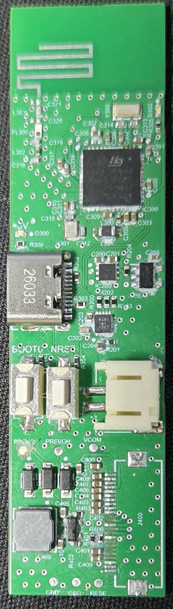
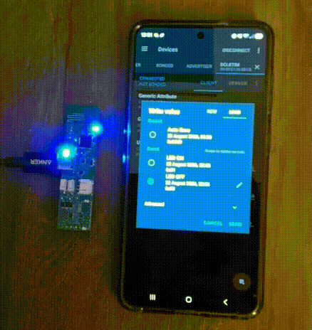
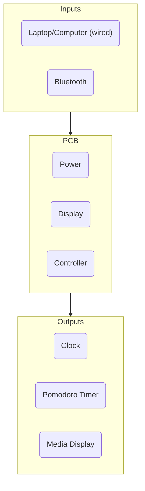

## Overview

A friend of mine saw a pomodoro timer online that he wanted to purchase, although it was a little expensive. I proposed that we could just do it ourselves for cheaper and for fun. The idea was to have a PCB driving an E-ink display. On the display, you could display a clock, current song playing on Spotify, Pomodoro timer, etc. We wanted it to be battery powered and rechargable over USB-C, as well as connect over Bluetooth for convencience. A 3D printed case was also in our plans.

I hadn't done any work with any kind of Bluetooth before, so that was the most interesting part to me. I also wanted to transition to working on stuff that I would use day to day, so this was perfect in that regard. I used this project as an opportunity to teach my younger brother a little bit about PCB design, and he did all the MCU decoupling and SPI connections, while my friend and I focused on the RF side, including the 2.4 GHz antenna, impedance matching, and filtering for Bluetooth.

It was important to consider return currents at this frequency, as current will try to find the lowest inductance -> lowest impedance path and stay underneath the signal trace -> solid ground beneath is crucial.

  

 

## Demo

The board connects over USB or Bluetooth Low Energy (BLE) and advertises as `DCLKTIM`. As a first test of the wireless link, writing to the P2P Server characteristic toggles the blue user LED — `0x01` turns it on, `0x00` turns it off.

  

 

## Status

Firmware is still in progress.

- **Bluetooth Low Energy:** Working. The board advertises as `DCLKTIM` and is discoverable in nRF Connect.
- **LED control over BLE:** Working. A single byte on the P2P Server characteristic toggles the blue user LED (`0x01` on, `0x00` off).
- **Display & battery:** Not yet tested. The 7.5" E-ink display and 4200 mAh Li-ion battery haven't been purchased yet.

## Architecture

The system is split into three parts: inputs, the PCB, and outputs.

## Hardware

The board is a compact STM32-controlled desk clock, powered over USB-C with a 4200 mAh lithium battery, driving a 7.5" E-ink display. The design was a big lesson in RF layout, and a few things I paid extra attention to are highlighted below.

### 2.4 GHz Antenna + RF Trace

The board uses a meander PCB antenna for the Bluetooth link. It's designed to present a 50 ohm impedance directly to the feedline, so the transceiver sees a clean match across the 2400-2480 MHz band instead of reflecting power back.

The RF trace is routed as a coplanar waveguide with the reference ground directly beneath, which also holds a 50 ohm characteristic impedance. 

### Shielding & Return Currents

Shielding vias are placed along the RF trace to stitch the top-side ground pour to the inner ground plane, forming a cage that reduces coupling and keeps the impedance stable. The solid ground directly under the trace also gives the return current a tight, direct path, which shrinks the loop area and cuts radiated noise.

### Antenna Keep-out

The zone around the antenna is kept clear of copper pours and ground planes so nothing detunes it.

### E-Ink Boost Converter

The E-ink panel needs a higher drive voltage than the 3.3 V rail, so a boost converter steps it up to about 22 V. The switching node and inductor loop are kept tight, short, and away from the RF traces to minimize EMI and switching losses — noise here would couple straight into the radio.

### USB-C

The D+/D- lines are routed as a 90 ohm differential pair, length-matched and tightly coupled, and protected with a TVS diode array that clamps ESD before it reaches the transceiver.

Soldering the flat flexible cable connector for the display was difficult and a few pads were unfortunately destroyed. Everything will be resoldered on a spare PCB in the near future.

## Firmware

The controller is an STM32WB35CCU6A, a dual-core part: the application runs on the Cortex-M4, while a prebuilt BLE stack runs on the Cortex-M0+. The coprocessor firmware has to be flashed separately and enabled before the board advertises, which made debugging the demo a little annoying. The full flashing steps are in the repository.

