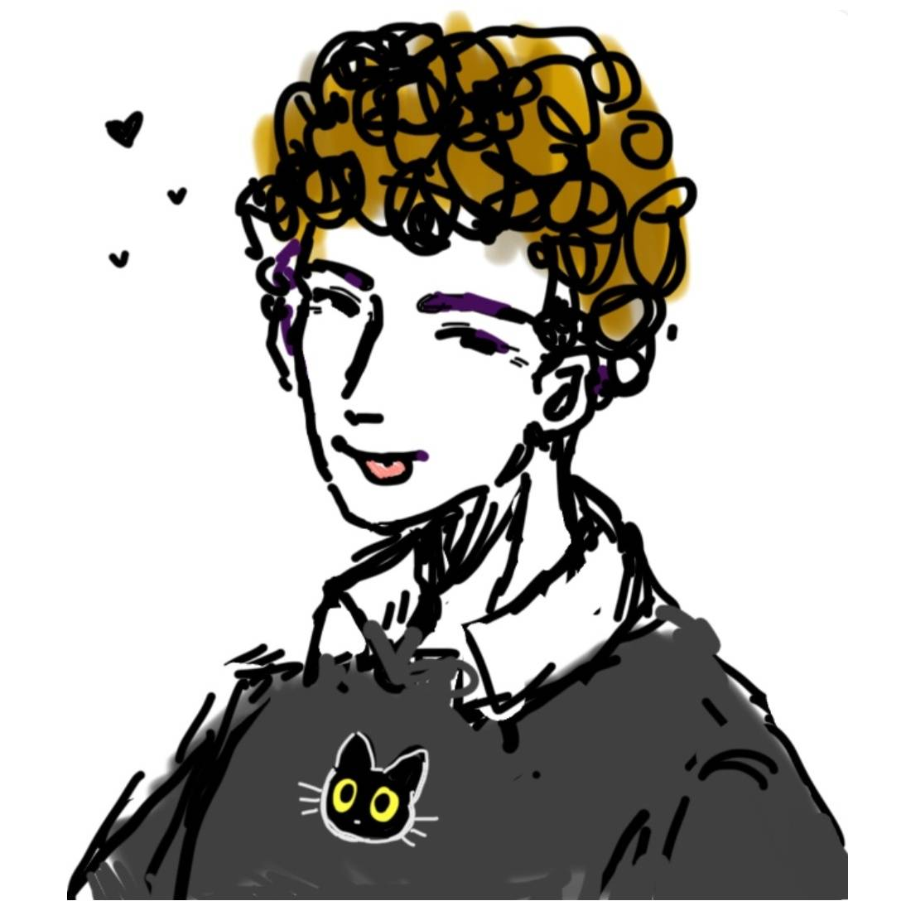
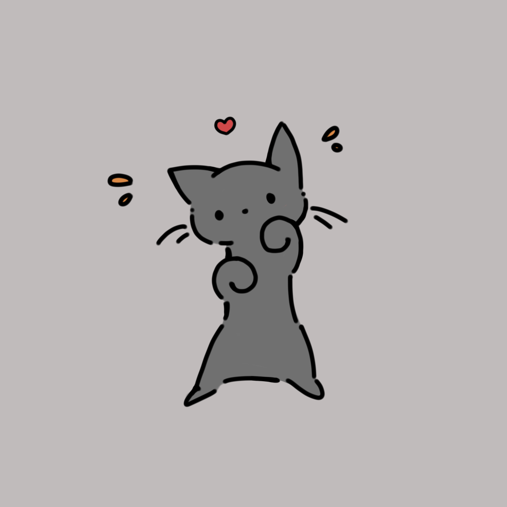
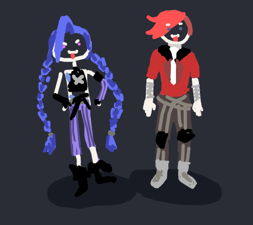
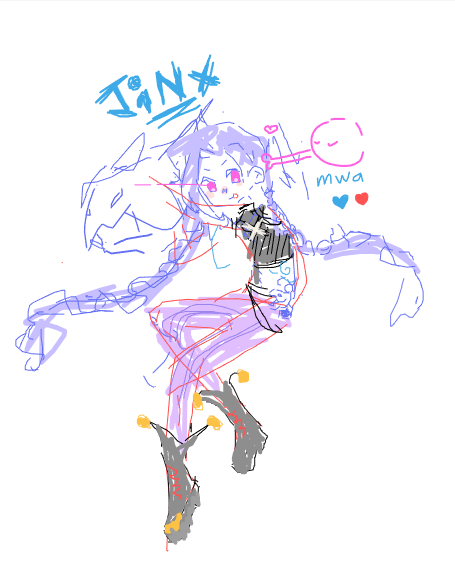

---
# the default layout is 'page'
icon: fas fa-info-circle
order: 5
---

{: w="200" .left}

Howdy, I'm David 'wavius' Ceuca, a second year Computer Engineering student at the University of Toronto, with a passion for hardware and electronics.

I have a background in PCB design, analog electronics, and embedded systems, with recent projects focusing more on FPGA development. My academic curiosity is currently leaning toward Analog IC design, though that may change in the future as I continue to learn about more interesting hardware.

 

I really love my girlfriend 🩵🩶, family, tennis, and cats 😻. Here are some doodles from my amazing girlfriend <3

{: w="500" .left}
{: w="500" .left}
{: w="500" .left}

